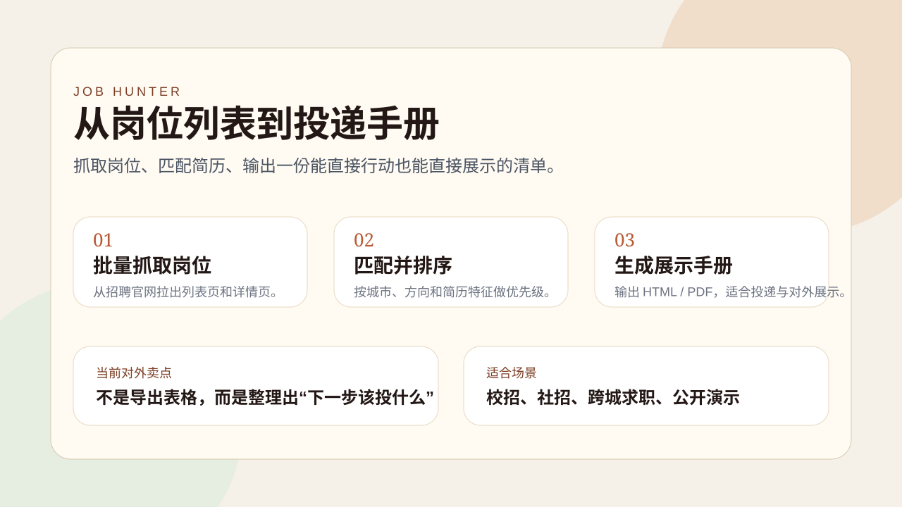
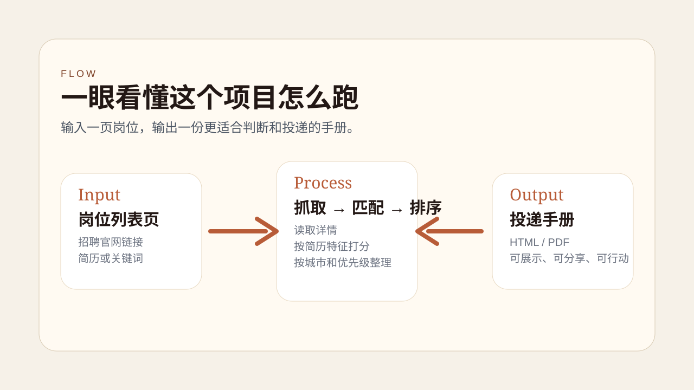
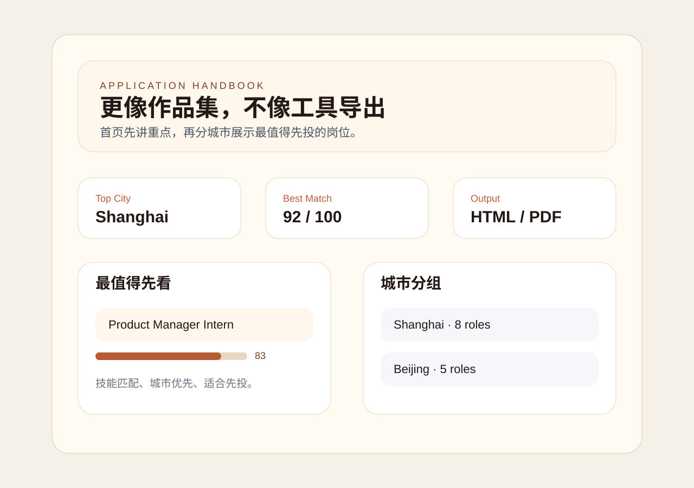

# job-hunter

Turn a long careers page into a short application handbook.



## What It Does

Instead of leaving you with a messy job list, `job-hunter` gives you a ranked handbook you can actually act on.

It handles the full path:

- collect jobs from a target site
- match them against your resume or keyword profile
- output a cleaner HTML or PDF handbook with apply links



## What People See

The output is meant to feel like a shortlist, not a data dump.



Public sample:

- sample handbook page: `examples/public-demo.html`

What the handbook already highlights:

- a simple 3-step story: collect → match → report
- a city-by-city shortlist
- score bars and priority hints
- a cover section that is easier to demo or share

## Quick Demo Line

`job-hunter` turns a noisy jobs page into a ranked application handbook.

## Quick Start

```bash
pip install -r requirements.txt
playwright install chromium
cp config/user.example.yaml config/user.yaml
python3 run.py --url "https://jobs.example.com/..." --resume ./resume.pdf
```

You fill in your own profile in `config/user.yaml`, then run one command.

## Public Demo

If you want to see the final result first, open:

- `examples/public-demo.html`

## How It Flows

| Step | What happens | Output |
|---|---|---|
| 1. Crawl | Read the target site and collect job details | `jobs_raw.json` |
| 2. Match | Score each job against your resume or keywords | `jobs_scored.json` |
| 3. Report | Turn the shortlist into a visual handbook | `handbook.html` / `handbook.pdf` |

## Who It Fits

| Use case | Why it helps |
|---|---|
| Campus hiring | Quickly narrow a large role list |
| Cross-city search | Compare cities in one place |
| Portfolio demo | Show a clear input → output workflow |
| Repeat job hunts | Reuse the same config and process |

## Configuration

Personal settings live in `config/user.yaml`.

| Section | What you set |
|---|---|
| `profile` | Name and resume path |
| `preferences` | Cities, role types, target direction, minimum score |
| `matching` | AI or keyword mode, skill keywords, boosts, exclusions |
| `output` | Output folder, format, summary text |

## Supported Site Styles

Most regular careers pages work with a YAML config only.

```bash
cp config/sites/generic.yaml config/sites/my-site.yaml
```

If a site is more complex, add a Python adapter in `hunter/crawler/adapters/`.

| Site | Config | Status |
|---|---|---|
| ByteDance | `config/sites/bytedance.yaml` | Verified |
| TikTok | `config/sites/tiktok.yaml` | Verified |

## Matching Modes

| Mode | What it means |
|---|---|
| AI | Use Claude API to understand resume and roles more semantically |
| Keyword | Run fully offline with configured keywords |

All scores are normalized to `0-100` before the report step.

## Common Commands

```bash
python3 run.py --url <job-site-url> --resume <resume.pdf>
python3 run.py --url <job-site-url> --mode keyword
python3 scripts/save_session.py
```

## Project Shape

| Path | Responsibility |
|---|---|
| `run.py` | Run the full pipeline |
| `hunter/crawler/` | Collect job listings |
| `hunter/matcher/` | Score jobs |
| `hunter/reporter/` | Build the visual handbook |
| `config/` | User settings and site configs |
| `templates/` | Report styles |
| `scripts/` | Helper scripts |

## Requirements

- Python 3.10+
- Playwright Chromium
- `pdfplumber`
- `anthropic` for AI mode

## Search Notes

| Source | Conclusion |
|---|---|
| `skills.sh` | 本轮没有新增功能模块，不需要额外搜索 |
| GitHub | 本轮重点是展示包装，不是新增抓取能力，所以也不重复搜索 |

## Done / Next

| Status | Item |
|---|---|
| Done | 更清晰的手册首页样式 |
| Done | 更稳定的 100 分制匹配分数 |
| Done | GitHub 首页横幅和展示文案 |
| Doing | 继续补公开展示素材 |

## License

MIT
